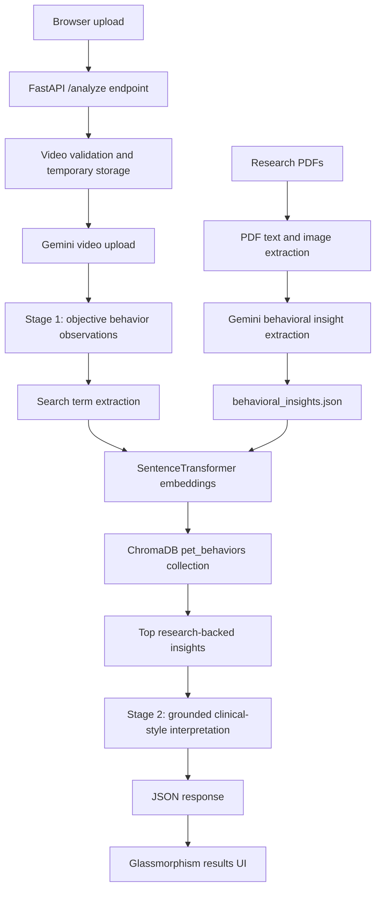

# PetTranslator 🐾🧠

**PetTranslator is a multimodal AI web app that turns short cat and dog videos into research-backed behavioral explanations.** It combines Gemini video understanding, a custom retrieval-augmented generation (RAG) pipeline, semantic search over animal-behavior literature, and a polished FastAPI interface to help owners understand observable pet body language in context.

Instead of asking an LLM to “guess what the pet feels,” the app follows a two-stage workflow: first it extracts concrete visual observations from the uploaded video, then it grounds the final interpretation in a local vector database built from research papers on canine and feline behavior.

> Built as a full-stack AI project demonstrating backend API design, multimodal prompting, document processing, vector search, RAG orchestration, and user-centered product polish.

---

## Why this project stands out

PetTranslator is more than a demo wrapper around an AI API. The codebase shows how to design an end-to-end AI product with grounding, retrieval, and thoughtful UX:

- **Multimodal video analysis**: uploads pet videos to Gemini, waits for file processing, and asks the model to produce detailed behavior observations before interpretation.
- **Research-backed RAG layer**: retrieves relevant cat/dog behavior evidence from a ChromaDB vector store instead of relying only on model priors.
- **Custom knowledge-building pipeline**: processes PDFs from the `research_papers/` corpus, extracts text/images, and uses Gemini to convert scientific material into structured behavioral insights.
- **Semantic search over behavior signals**: maps phrases like “ears down,” “crouching,” or “nose licking” to similar research-derived indicators using sentence-transformer embeddings.
- **Production-oriented API flow**: validates video file type/size, handles quota/rate-limit failures, cleans up remote Gemini files, and returns structured JSON for the frontend.
- **Recruiter-friendly full-stack scope**: Python backend, async workflows, vector databases, prompt engineering, document ingestion, frontend state management, and polished glassmorphism UI.

---

## Product experience

1. **Upload a pet video** from the browser.
2. **Select pet type** so the analysis can be filtered for cat or dog behavior.
3. **Gemini watches the clip** and generates objective observations: posture, ears, tail, eyes, movement, facial expression, interaction, and vocalization cues.
4. **RAG retrieves matching research insights** from the local behavioral knowledge base.
5. **The app returns a readable interpretation** with an optional technical panel showing the observations and top retrieved evidence.

The result is a product that feels approachable to pet owners while exposing the technical rigor behind the scenes.

---

## Architecture



### Runtime analysis path

- `main.py` owns the FastAPI app, upload validation, Gemini video lifecycle, two-stage analysis, error handling, and HTTP routes.
- `rag_interface.py` exposes a simple singleton-style interface so the web app can query research insights without knowing ChromaDB internals.
- `rag_system.py` initializes the embedding model and ChromaDB collection, indexes behavioral insights, runs semantic search, and returns similarity-scored matches.
- `templates/index.html` and `static/style.css` provide the interactive upload/results experience.

### Knowledge ingestion path

- `document_processor.py` extracts text and images from PDFs and prompts Gemini to turn research content into structured behavior records.
- `process_research_papers.py` orchestrates processing across the cat, dog, and general research folders.
- `behavioral_insights.json` stores the extracted knowledge base that is embedded into ChromaDB.
- `research_papers/` contains the source behavior literature used to build the system’s domain knowledge.

---

## Repository map

```text
.
├── main.py                     # FastAPI app and two-stage Gemini + RAG video analysis
├── rag_interface.py            # Production interface for querying and formatting RAG results
├── rag_system.py               # ChromaDB + SentenceTransformer semantic retrieval engine
├── document_processor.py       # PDF text/image extraction and LLM insight extraction pipeline
├── process_research_papers.py  # Batch processing script for the research corpus
├── rag_test.py                 # Small CLI helper for testing behavior search queries
├── behavioral_insights.json    # Structured cat/dog behavior knowledge base
├── research_papers/            # Source PDFs organized by dogs, cats, and general studies
├── templates/index.html        # Frontend upload/results UI and client-side state management
├── static/style.css            # Responsive glassmorphism visual design
├── requirements.txt            # Python runtime dependencies
└── README_RAG_Step1.md         # Earlier notes for the RAG ingestion milestone
```

---

## Key technical decisions

### Two-stage prompting for better reliability

PetTranslator separates **observation** from **interpretation**. The first Gemini call focuses on visible facts only, such as body posture, ear position, tail movement, eye appearance, movement, and environment interaction. Those observations become search terms for RAG. The second call receives the observations plus retrieved research context and produces the final explanation.

This design reduces hallucination risk because the app grounds interpretation in observable signals and relevant retrieved evidence.

### Local vector search instead of API-only retrieval

The RAG system uses:

- **SentenceTransformers** with `all-MiniLM-L6-v2` for local embeddings.
- **ChromaDB** for persistent vector storage.
- **Metadata filters** for pet type and confidence level.
- **Similarity scoring** so retrieved evidence can be ranked and displayed.

This keeps the research layer transparent, inspectable, and inexpensive to run.

### Domain-specific data pipeline

The project includes a document pipeline that converts animal-behavior papers into structured insight records. Each insight includes fields like behavior name, pet type, meaning, confidence, source type, source document, and processed date. The current `behavioral_insights.json` contains **545 extracted behavior records** from the included corpus.

### User experience polish

The frontend is intentionally designed as a consumer product, not a developer-only API:

- Drag-and-drop upload flow.
- Pet type selection.
- Processing state with progress feedback.
- Result video playback.
- Typewriter-style analysis reveal.
- Optional technical details panel with observations and RAG matches.
- Special handling for API quota exhaustion.

---

## Tech stack

| Layer | Tools |
| --- | --- |
| Backend | FastAPI, Uvicorn, Jinja2 |
| Multimodal AI | Google Gemini via `google-generativeai` |
| RAG / Retrieval | ChromaDB, SentenceTransformers |
| Document processing | PyPDF2, PyMuPDF, Gemini extraction prompts |
| Frontend | HTML, CSS, vanilla JavaScript |
| Media utilities | FFmpeg / ffprobe |
| Configuration | python-dotenv |

---

## Getting started

### 1. Clone and create an environment

```bash
git clone <your-repo-url>
cd pettranslator
python -m venv venv
source venv/bin/activate
pip install -r requirements.txt
```

### 2. Install system media tools

`ffprobe` is used to inspect uploaded video duration, so install FFmpeg if it is not already available:

```bash
# macOS
brew install ffmpeg

# Ubuntu/Debian
sudo apt-get update && sudo apt-get install -y ffmpeg
```

### 3. Configure Gemini

Create a `.env` file:

```bash
GOOGLE_API_KEY=your_google_gemini_api_key
```

### 4. Run the app

```bash
uvicorn main:app --reload
```

Open `http://127.0.0.1:8000` and upload a short `.mp4`, `.mov`, `.avi`, `.mkv`, or `.webm` file.

---

## Working with the RAG system

### Test behavior retrieval

```bash
python rag_test.py
```

Example queries to try inside the helper:

- `flattened ears` for cats or dogs
- `tail wagging` for dogs
- `dilated pupils` across all pet types
- `nose licking` for dogs

### Rebuild or extend behavioral insights

Add new PDFs to one of the corpus folders:

```text
research_papers/cats/
research_papers/dogs/
research_papers/general/
```

Then run:

```bash
python process_research_papers.py
```

The processing pipeline updates `behavioral_insights.json`, which can then be indexed into the ChromaDB collection by the RAG system.

---

## API behavior

### Main page

```http
GET /
```

Renders the upload interface.

### Analyze video

```http
POST /analyze
```

Accepts multipart form data with:

- `file`: uploaded video file
- `pet_type`: `dog` or `cat`

Returns structured JSON including:

- `stage1_observations`
- `stage1_description`
- `stage2_clinical_analysis`
- `stage2_research_used`
- `stage2_top_insights`
- `pet_type`
- `timestamp`

---

## What I would improve next

- Add automated unit tests for file validation, RAG result formatting, and API error paths.
- Cache Gemini file-processing status more elegantly for longer videos.
- Add Docker support for easier reviewer setup.
- Persist analysis history with user-owned privacy controls.
- Add authentication and rate limiting for public deployment.
- Add structured citations in the UI so users can trace each interpretation to source documents.
- Expand the corpus with veterinary-reviewed sources and more species-specific behavior categories.

---

## Skills demonstrated

This project demonstrates practical experience with:

- Building async Python APIs with FastAPI.
- Designing multimodal LLM workflows.
- Prompt engineering for observation extraction and grounded interpretation.
- Implementing RAG with embeddings, vector search, metadata filters, and source-aware results.
- Creating an LLM-powered document ingestion pipeline.
- Handling media uploads, validation, temporary files, and external API lifecycles.
- Shipping a user-friendly frontend with stateful interactions and polished styling.
- Communicating technical architecture clearly for maintainers and reviewers.

---

## Note

PetTranslator is an educational and exploratory AI project. It is not a veterinary diagnostic tool. Behavioral interpretations should be treated as informational and should not replace professional veterinary advice, especially for signs of pain, distress, aggression, or illness.
